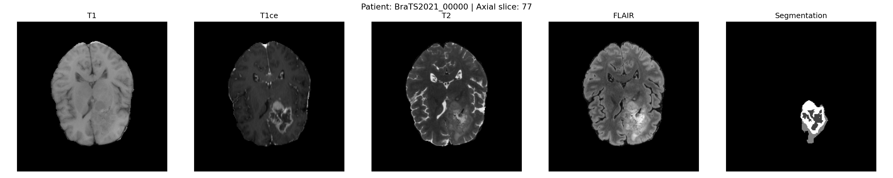

# Pediatric Tumor Detection Pipeline
> A deep learning pipeline for brain tumor segmentation, quantification, and explainability — built on BraTS 2021 data.

  

---

## Overview



This project builds an end-to-end AI pipeline that mimics clinical tumor analysis workflows used in hospital radiology departments. It takes raw brain MRI scans, segments tumor regions using a deep learning model, quantifies tumor properties, and explains model decisions visually.

Built as a research demo to explore how explainable AI can support radiologist decision-making — directly motivated by work in quantitative imaging and trustworthy AI.

---

## Dataset

**BraTS 2021** (Brain Tumor Segmentation Challenge)
- 1,251 patients with glioblastoma and lower-grade glioma
- 4 MRI modalities per patient: T1, T1ce (contrast-enhanced), T2, FLAIR
- Expert-annotated tumor segmentation masks with 4 tumor sub-regions:
  - 0: Background
  - 1: Necrotic tumor core
  - 2: Peritumoral edema
  - 4: Enhancing tumor

Each volume is 240×240×155 voxels in NIfTI format (.nii.gz).

---

## Project Structure

```
pediatric-tumor-pipeline/
├── raw/                  # BraTS 2021 patient folders (not tracked in git)
├── processed/            # Normalized .npy arrays (not tracked in git)
├── scripts/
│   ├── explore_data.py   # Visualize MRI modalities for a single patient
│   └── pipeline.py       # Full data curation pipeline
├── manifest.json         # Train/val/test split for all 1,251 patients
└── README.md
```

---

## Pipeline — Part 1: Data Curation

**Script:** `scripts/pipeline.py`

Real medical imaging data is messy and inconsistent. This pipeline handles:

**Loading**
- Reads all 4 MRI modalities + segmentation mask per patient using `nibabel`

**Normalization**
- Z-score normalization per modality, computed only over non-background voxels
- Ensures consistent intensity scale across patients and MRI scanners
- Formula: `(x - mean) / std` where mean/std are computed over brain tissue only

**Slice Selection**
- Keeps the middle 60% of axial slices (removes top/bottom edges which are mostly empty skull)
- Reduces from 155 → 107 slices per patient

**Train/Val/Test Split**
- 70% train (875 patients), 15% val (188), 15% test (188)
- Reproducible with `random_state=42`
- Saved to `manifest.json`

**Output per patient:**
- `{patient_id}_data.npy` — shape `(4, 240, 240, 107)` — 4 normalized modalities
- `{patient_id}_seg.npy`  — shape `(240, 240, 107)` — integer tumor mask

---

## Roadmap

- [x] Data curation pipeline (normalization, slice filtering, split)
- [x] Dataset manifest (JSON)
- [ ] 2D U-Net segmentation model (PyTorch)
- [ ] Dice coefficient validation
- [ ] MC Dropout uncertainty estimation
- [ ] Grad-CAM explainability overlays
- [ ] Tumor quantification (volume mm³, bounding box, shape features)
- [ ] Streamlit web app for radiologist-friendly visualization

---

## Quickstart

```bash
# Clone the repo
git clone https://github.com/aayandeb/pediatric-tumor-pipeline.git
cd pediatric-tumor-pipeline

# Install dependencies
pip install nibabel matplotlib numpy scikit-learn tqdm

# Visualize one patient (requires BraTS 2021 data in raw/)
python3 scripts/explore_data.py

# Run the full curation pipeline
python3 scripts/pipeline.py
```

---

## Key Design Decisions

**Why BraTS 2021?**
It is the most widely cited benchmark dataset for brain tumor segmentation, used in hundreds of peer-reviewed papers. Pre-registered annotations from expert neuroradiologists make it clinically credible.

**Why Z-score normalization?**
MRI intensities are not standardized across scanners or acquisition protocols — unlike CT where Hounsfield units are absolute. Z-score normalization over brain tissue (excluding background) is the standard approach in medical imaging literature.

**Why keep only the middle 60% of slices?**
The top and bottom axial slices contain mostly skull and empty space with little diagnostic value. Removing them reduces data size and focuses the model on clinically relevant brain tissue.

---

## Dependencies

| Package | Purpose |
|---|---|
| nibabel | Load NIfTI MRI files |
| numpy | Array operations |
| matplotlib | Visualization |
| scikit-learn | Train/val/test splitting |
| tqdm | Progress bars |
| torch (coming) | U-Net model training |

---

## Motivation

This project is inspired by clinical AI workflows in radiology departments, where quantitative imaging and explainable AI are increasingly critical for radiologist trust and adoption. The goal is to build something that reflects real hospital AI pipelines — not just a classification model, but a full system from raw data to interpretable output.

---

*Built by Aayan Pratim Deb — sophomore CS, independently exploring medical AI.*
